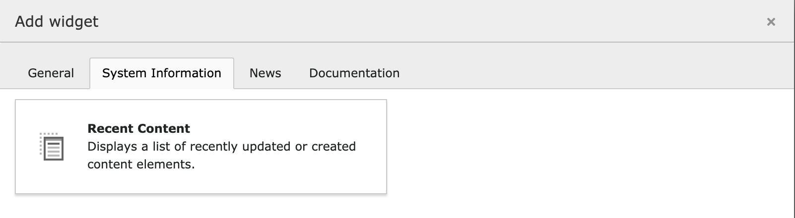

# Recent Content Widget

This TYPO3 extension provides a dashboard widget that displays a list of last modified or created content elements. It considers page access permissions to show only accessible content elements for the current backend user.



## Installation

```bash
composer require epixskill/recent-content-widget
```

or use the ExtensionManager.